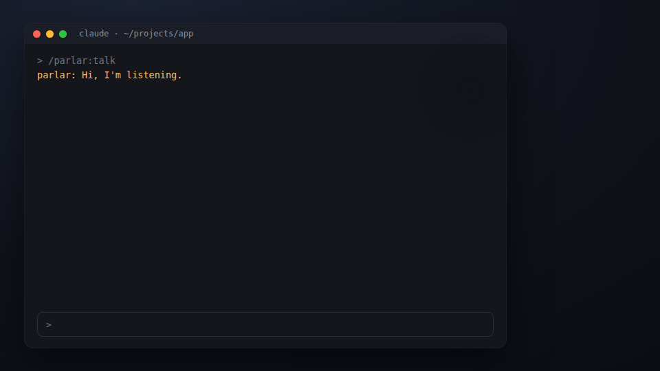

<div align="center">
  <h1>parlar</h1>
  <p><strong>Talk to your coding agent. It talks back while it works.</strong></p>
  <p>
    <a href="https://github.com/agent-sh/parlar/actions/workflows/ci.yml"></a>
    <a href="https://crates.io/crates/parlar"></a>
    <a href="https://www.npmjs.com/package/@agent-sh/parlar"></a>
    <a href="#license"></a>
  </p>
</div>

> Running open models for your company? [**Tiyuvta**](https://tiyuvta.ai/services/) helps with model choice, deployment and optimization, and fine-tuning on your hardware or cloud account.

<p align="center"></p>
<p align="center"><sub>A staged demo (<a href="design/demo.html">design/demo.html</a>): the session and the swarm are drawn from a script, not captured.</sub></p>

parlar is a voice conversation mode for Claude Code and Codex. You speak, and the session hears you
whether it is idle or in the middle of work. It answers out loud in short sentences, while tool
calls, diffs and logs stay in the terminal as usual. The spoken exchange is printed in the session,
so you can read back what was said.

Everything runs locally on the CPU. No audio and no transcript leaves your machine.

## What this is

- **A harness plugin, not a terminal wrapper.** It is an MCP server plus hooks. It never types into
  your terminal, so it works with any harness in any shell, tmux or not.
- **Real push.** Speech reaches an idle session (a background Stop hook wakes it) and a busy one (a
  hook after each tool call hands it your words). A spoken "stop" blocks its next tool call.
- **Explicit focus.** One session hears you at a time: the one you started with `/parlar:talk` or
  picked from the indicator. Other sessions never get your speech.
- **Made for thinking out loud.** It waits through "so...", "and..." and thinking pauses. When you
  correct yourself, the last version wins. Talk over the voice and it stops.
- **Light when idle.** `parlard` idles at about 20 MB with the mic closed. Models load when a
  conversation starts and unload two minutes after it stops.

## Features

- Listening: Silero VAD marks speech and pauses after echo cancellation, noise suppression and
  automatic gain (WebRTC AEC3 through sonora). That makes a laptop mic usable while the agent
  speaks. Nothing is transcribed while nobody talks.
- Recognition: Phonon-2 in ONNX, run at each pause on the turn so far. Spoken file names ("format
  dot rs") are joined into the names of the repo you are working in.
- End of turn: word rules plus the Smart Turn v3.2 audio model.
- Voice: Kokoro-82M, synthesized one sentence at a time, so there are no seams inside a sentence.
- Indicator (GNOME): a small swarm of fireflies floating above your windows. Blue is you, amber is
  the agent, and a red spark is a failed tool call. Click to stop or start. Right-click to pick the
  session, the mic and the speaker, or to mute or turn the voice off.
- Devices: switch input and output at run time. The choice is remembered, and a headset that drops
  out is reopened when it comes back.
- Token cost: the agent's spoken lines are short, and the plugin, not the agent, prints the
  transcript.

## Support matrix

| | Status |
|---|---|
| Linux x86_64, aarch64 | supported (prebuilt binaries and crates) |
| Windows x86_64 | supported: daemon, voice, recognizer, named pipe, login service, plugin launchers and the floating indicator (`parlar-overlay`), tested on Windows 11 |
| Audio | PipeWire |
| Claude Code | full: idle wake, mid-turn steering, spoken stop, transcript in the session |
| Codex | say tool, mid-turn steering, blocking Stop waiter. A brand-new session hears you after its first turn |
| Indicator | GNOME Shell 50 on Linux; `parlar-overlay` on Windows and macOS. Other Linux desktops work without the floating indicator |
| macOS (Apple silicon) | in progress: on CI it builds, fetches, speaks, recognizes, loads its launchd agents and runs the plugin paths, and the floating indicator starts; the mic, the speaker, the indicator on a real desktop and Claude Code itself are untested on a real Mac |

## Install

All options end the same way: `parlar` and `parlard` on your PATH, the models downloaded once
(about 800 MB) into `$XDG_DATA_HOME/parlar`, and the `parlard` user service running.

### Option A: from Claude Code

```
/plugin marketplace add agent-sh/parlar
/plugin install parlar@parlar
/parlar:setup
```

`/parlar:setup` checks your machine and installs what is missing, asking before each step that
changes your system.

### Option B: `scripts/install.sh` from a clone

Needs cargo ([rustup.rs](https://rustup.rs)), git, curl, clang, and the PipeWire and ALSA headers
(Debian/Ubuntu `libpipewire-0.3-dev libasound2-dev`, Fedora `pipewire-devel alsa-lib-devel`, Arch
`pipewire alsa-lib`).

```
git clone https://github.com/agent-sh/parlar && cd parlar
scripts/install.sh
```

It builds, installs into `~/.local` (set `PREFIX` to change it), and downloads libmoonshine and the
models. It also writes the plugins into a local marketplace, installs the GNOME indicator, and
starts the service. `--no-service` skips the service.

### Option C: npm

```
npm install -g @agent-sh/parlar
parlard fetch      # libmoonshine and the models, once
parlard service    # systemd user service for this parlard
```

The package downloads the release binaries for your machine and checks their sha256. If your npm
blocks install scripts, add `--allow-scripts=@agent-sh/parlar`.

On Windows, the npm package ships everything, including the Visual C++ runtime and the floating
indicator. Then run `parlard fetch` and `parlard service`, which starts parlard and the indicator
at login through your user's Run key.

### Option D: `cargo install`

```
cargo install parlar parlard
parlard fetch      # libmoonshine and the models, once
parlard service    # systemd user service for this parlard
```

On Windows, `cargo install` needs the [Visual C++ Redistributable](https://aka.ms/vs/17/release/vc_redist.x64.exe)
installed; `parlard fetch` adds ONNX Runtime. On macOS, `parlard fetch` adds ONNX Runtime and links
it next to the `parlard` binary (macOS binds it at launch), and `parlard service` installs a launchd
agent (`~/Library/LaunchAgents/dev.agent-sh.parlard.plist`).

### Option E: prebuilt binaries

Each [release](https://github.com/agent-sh/parlar/releases) has
`parlar-<version>-<target>.tar.gz` with a `.sha256` next to it. Put `parlar` and `parlard` on your
PATH, then run `parlard fetch` and `parlard service`.

The GNOME indicator is in `shell/gnome/parlar@avifenesh`. Copy it to
`~/.local/share/gnome-shell/extensions/` and run `gnome-extensions enable parlar@avifenesh`.
GNOME on Wayland loads new extensions at your next login.

On macOS the binaries are not notarized, so a downloaded tarball carries Apple's quarantine mark:
they run from a terminal, but Gatekeeper refuses a double-click and `spctl` reports them as
rejected. To clear the mark after unpacking:

```
xattr -dr com.apple.quarantine parlar-*-aarch64-apple-darwin
```

`parlard fetch` then downloads the models and links ONNX Runtime beside the binaries, and
`parlard service` installs the launchd agent.


## Wire it into your harness

### Claude Code

```
claude plugin marketplace add agent-sh/parlar     # or the local one install.sh printed
claude plugin install parlar@parlar
parlar setup claude                               # say speaks without a permission prompt
```

Optional status line: set `statusLine.command` to `parlar status`, with `refreshInterval: 1`.

### Codex

```
codex plugin marketplace add ~/.local/share/parlar/marketplace/codex
codex plugin add parlar@parlar
```

Trust the parlar hooks once from Codex's hooks review prompt. Codex has no background wake, so a
brand-new Codex session hears you after its first turn; after that, speaking continues the
conversation. Start with `parlar ctl talk --session <id> --harness codex`, or from the indicator
menu.

## Use

| | |
|---|---|
| `/parlar:talk` | start talking to this session (it gets voice focus) |
| `/parlar:stop` | stop; the mic closes |
| `/parlar:mute`, `/parlar:mute off` | mute or unmute the mic; the conversation stays on |
| click the swarm | stop or start |
| right-click the swarm | pick the session, input and output devices, mute, voice off |

While the agent works you can steer it ("also update the tests"), and "stop" or "wait" blocks its
next tool call. When it is idle, speaking wakes it.

From the shell:

```
parlar ctl state                  # what parlar is doing and which session has focus
parlar ctl devices                # inputs and outputs
parlar ctl input <id>             # switch the mic (remembered across restarts)
parlar ctl output <id>            # switch the speaker
parlar ctl voice-off              # captions only, no audio out
parlar status                     # one line, for a status line
```

### Headsets

Bluetooth headsets have two modes. High-quality playback (A2DP) turns the headset mic off, so
parlar then needs another mic, such as the laptop's. Hands-free mode has a working mic and
lower-quality audio, and parlar works with it. `parlar ctl input pipewire:input_default` makes the
mic follow the system default.

## Models

`parlard fetch` downloads everything once. Each file is pinned to a revision or release and checked
by size and checksum (sha256, or CRC32C from Moonshine's manifest for Kokoro).

| Model | Role | On disk | License | Source |
|---|---|---:|---|---|
| Phonon-2 ONNX, int8 encoder | speech recognition | 657 MB | CC-BY-4.0 | [tiyuvta/Phonon-2-ONNX](https://huggingface.co/tiyuvta/Phonon-2-ONNX) |
| Kokoro-82M | voice | 104 MB | Apache-2.0 | through libmoonshine |
| Smart Turn v3.2 | end of turn | 8 MB | BSD-2-Clause | [pipecat-ai/smart-turn-v3](https://huggingface.co/pipecat-ai/smart-turn-v3) |
| Silero VAD v6 | voice activity | 2 MB | MIT | [snakers4/silero-vad](https://github.com/snakers4/silero-vad) |
| libmoonshine v0.1.5 + ONNX Runtime 1.23 | runtime | 33 MB | MIT | [moonshine-ai/moonshine](https://github.com/moonshine-ai/moonshine) |

Phonon-2 is Fermion Research's English recognizer derived from NVIDIA's Parakeet TDT 0.6B v3. We
exported it to ONNX and publish it on Hugging Face. The int8 encoder scores 4.35% WER on LibriSpeech
dev-clean, against 4.26% for the exact fp32 export. The model card has the details.

## Language, recognizer and voice

Settings live in `~/.config/parlar/config.toml` (`$XDG_CONFIG_HOME/parlar/config.toml`). Every key
is optional; without the file parlar is English with Phonon-2 and Kokoro's af_heart voice.

```toml
language = "es"                   # what you speak and what the voice speaks

[recognizer]
model = "parakeet-tdt-0.6b-v3"    # phonon-2 (English), parakeet-tdt-0.6b-v3, or a model directory
encoder = "int8"                  # int8, exact4x2 or fp32, when the model ships them

[voice]
name = "kokoro_ef_dora"           # any voice libmoonshine has for the language
command = ["espeak-ng", "-v", "es"]   # or speak through any program that reads text on stdin
```

After a change, run `parlard fetch` (it downloads only what the new settings need) and restart the
service. `parlard config` prints what is in use.

| Language | Recognizer | Voice |
|---|---|---|
| English (`en`, `en-gb`) | Phonon-2 (default) or Parakeet | Kokoro |
| Spanish, French, Italian, Portuguese (`es`, `fr`, `it`, `pt`) | Parakeet | Kokoro |
| German, Russian (`de`, `ru`) | Parakeet | Piper (through libmoonshine) |
| Japanese, Chinese, Hindi (`ja`, `zh`, `hi`) | a model directory you supply | Kokoro |
| 18 more European languages Parakeet knows (`pl`, `nl`, `sv`, `uk`, ...) | Parakeet | your `[voice] command` |

A model directory is any ONNX export in the onnx-asr `nemo-conformer-tdt` layout (encoder,
decoder_joint, vocab.txt, and a preprocessor). Hebrew is not covered by either recognizer or
libmoonshine yet. Outside English the turn rules rely on punctuation and the Smart Turn model,
which is multilingual, rather than on English filler words.

## Resource use

Measured on a Core Ultra 9 275HX laptop:

| State | RAM | CPU |
|---|---:|---|
| idle (no conversation) | about 20 MB | none, mic closed |
| conversation on, nobody talking | about 1.4 GB | about 2% of one core |
| a turn ends | peak about 1.4 GB | 1 to 2 s of recognition on 4 cores |
| speaking | | first audio in 0.3 to 0.5 s, synthesis about 2x faster than real time |

Two minutes after you stop, the models and the voice unload and the memory goes back to the
system.

## Architecture

```
mic -> AEC/NS/AGC -> Silero VAD -> (pause) Phonon-2 -> endpointer + Smart Turn -> utterance
                                                                                     |
harness <- hooks + MCP (parlar) <- unix socket <- parlard (focus, routing, voice) <--+
   |
   +-> say tool -> parlard -> Kokoro -> speaker (barge-in cuts it)
```

- `parlar` is the light binary: the MCP server, the hooks and `ctl`. Hooks run on every tool call,
  so they use no async runtime, return in milliseconds, and do nothing when `parlard` is not
  running.
- `parlard` is the daemon. It owns the mic, the speaker, the models and which session has focus,
  and it listens on `$XDG_RUNTIME_DIR/parlar/parlar.sock`.
- Design notes and the decision log are in [docs/DESIGN.md](docs/DESIGN.md).

## Privacy

Audio is processed in memory and never written to disk, unless you set `PARLAR_DUMP_TURNS` for
debugging. Transcripts go only to the focused session, through the plugin. Nothing is sent over the
network after `parlard fetch`.

## Troubleshooting

- `journalctl --user -u parlard -f` shows what parlar hears (`hearing:`), where each utterance went
  (`heard u3`), and when models load and unload.
- Nothing is heard: check `parlar ctl state` (is it on, and is a session focused?), then the mic
  with `parlar ctl devices`. A Bluetooth headset in A2DP mode has no mic.
- Your words go to the wrong session: run `/parlar:talk` in the session you want.
- `parlard fetch` downloads missing files again. `parlard speak "hello"` writes a test line to
  `parlar-speak.wav`, and `parlard final file.wav` runs a recording through the recognizer.

## Uninstall

```
systemctl --user disable --now parlard
claude plugin uninstall parlar@parlar
rm -rf ~/.local/bin/parlar ~/.local/bin/parlard ~/.local/share/parlar \
       ~/.config/parlar ~/.config/systemd/user/parlard.service \
       ~/.local/share/gnome-shell/extensions/parlar@avifenesh
```

## Related

- [computer-use-linux](https://github.com/agent-sh/computer-use-linux): Linux desktop control over
  MCP.
- [agent-workspace-linux](https://github.com/agent-sh/agent-workspace-linux): isolated desktops for
  agents.

## Contributing

See [CONTRIBUTING.md](CONTRIBUTING.md). Conventions for agents working on this repo are in
[AGENTS.md](AGENTS.md).

## Credits

- Phonon-2 by [Fermion Research](https://huggingface.co/FermionResearch/Phonon-2), from NVIDIA's
  Parakeet TDT 0.6B v3. ONNX conversion by [Tiyuvta](https://huggingface.co/tiyuvta).
- [Moonshine](https://github.com/moonshine-ai/moonshine) for libmoonshine and its Kokoro pipeline.
- [Kokoro-82M](https://huggingface.co/hexgrad/Kokoro-82M),
  [Smart Turn](https://github.com/pipecat-ai/smart-turn) by Pipecat, and
  [Silero VAD](https://github.com/snakers4/silero-vad).
- [sonora](https://crates.io/crates/sonora), a Rust port of the WebRTC audio processing module.

## License

parlar is MIT or Apache-2.0, at your option ([LICENSE-MIT](LICENSE-MIT),
[LICENSE-APACHE](LICENSE-APACHE)). The models and libraries it downloads keep their own licenses,
listed under [Models](#models). It links sonora (BSD-3-Clause) and loads ONNX Runtime (MIT).
